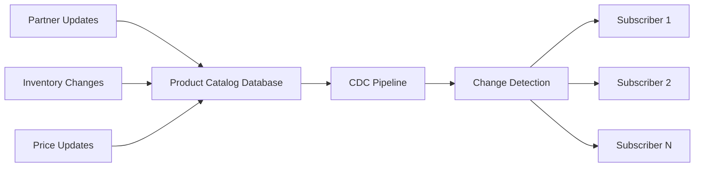
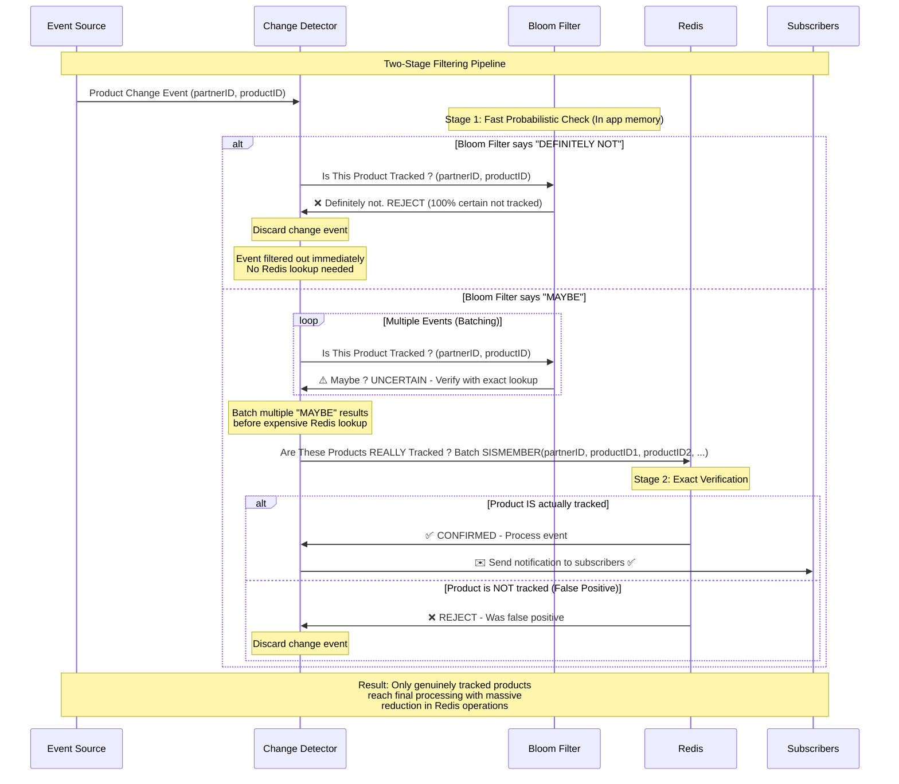

# Scaling Change Data Capture for Black Friday: A Probabilistic Approach with Bloom Filters

At Insider, our Product Catalog Database (PCD) receives millions of product updates daily. Our Change Data Capture (CDC) pipeline captures these database changes and delivers notifications to subscribers who are actively tracking specific products. As we prepare for upcoming peak seasons like Black Friday, one of our biggest challenges is efficiently filtering change notifications to deliver **only** relevant updates to the right subscribers. Enter Bloom filters—our solution to this challenge.



## The Challenge: Preparing for Peak Traffic at Scale

Our PCD pipeline handles product data from multiple sources and partners. When a product's price or stock status changes, we need to notify subscribers who have explicitly requested updates for those specific products. However, checking every change against every subscription in our database would be computationally expensive and slow.

The challenge becomes even more critical during high-traffic events. Take Black Friday, for example—when retailers launch massive sales campaigns, our system experiences:
- **Price drops** across millions of products as discounts go live
- **Stock status changes** as popular items sell out rapidly
- **Inventory updates** as retailers adjust quantities in real-time
- **Flash sales** creating sudden spikes in change notifications

During these peak periods, our CDC pipeline can see **20x normal traffic volumes**. Without efficient filtering, we'd be checking every single change against thousands of subscriptions, creating a perfect storm of database load and latency issues.

The core challenges we're addressing include:
- 1M+ product updates per minute during peak events
- Thousands of active subscriptions per partner
- Multiple partners with different tracking requirements
- Sub-second response time requirements

## Enter Bloom Filters: Our Probabilistic Solution

A Bloom filter is essentially a probabilistic approximation of a hash set—a space-efficient data structure that can replace exact sets in scenarios where you can tolerate some uncertainty. It operates on a fascinating principle: it can tell us with **absolute certainty** that an element is "DEFINITELY NOT in a set," but only with **probability** that an element "MAY BE in a set."

### How the Probabilistic Magic Works

The beauty lies in its asymmetric certainty. When a Bloom filter says "NO," you can trust it completely—there's zero chance of a false negative. But when it says "MAYBE," there's a calculated risk it could be wrong (a false positive). 


[How Bloom Filters work](https://llimllib.github.io/bloomfilter-tutorial/)


This probabilistic nature means we can achieve massive space savings compared to exact data structures, trading perfect accuracy for dramatic efficiency gains—exactly what we need for high-throughput filtering.




**How the Two-Stage Filtering Works:**

This sequence diagram illustrates our probabilistic filtering pipeline where Bloom filters act as a high-speed pre-filter before expensive exact lookups:

- **Stage 1 (Bloom Filter)**: Lightning-fast in-memory check that eliminates the vast majority of untracked products with zero false negatives
- **Stage 2 (Redis Lookup)**: Exact verification only for products that pass the Bloom filter, handling the small percentage of false positives

The key insight is that Bloom filters excel at saying "definitely not tracked" with absolute certainty, allowing us to avoid most Redis operations while ensuring we never miss a genuinely tracked product.

## Architecture: Our Two-Stage Filtering Approach

Our change detection system is designed with a two-stage filtering approach:

### Stage 1: Bloom Filter Quick Check
When a change event arrives, we first check if the product ID exists in the partner-specific Bloom filter cached locally in application memory. This happens in microseconds and eliminates the vast majority of non-tracked items immediately.

The projected memory efficiency is remarkable—our Bloom filters require 99% less memory compared to storing exact hash sets of tracked products. This allows us to keep all partner filters in memory without significant memory overhead.

```
function FilterTrackingItems(changeItems):
    itemsToValidate = []
    
    for each item in changeItems:
        if BloomFilterMightContain(item.partnerID, item.documentID):
            itemsToValidate.add(item)  // Might be tracked, needs verification
        // else: definitely not tracked, skip entirely
    
    return validateInRedis(itemsToValidate)  // Stage 2
```

### Stage 2: Redis Set Validation
For items that pass the Bloom filter check (potential matches + false positives), we perform exact lookups in Redis sets to confirm if they're actually being tracked. We use Redis **SISMEMBER** operations in a pipeline for efficient batch validation of multiple productIDs simultaneously.

```
function validateInRedis(itemsToValidate):
    validatedItems = []
    
    // Batch Redis SISMEMBER operations for efficiency
    pipeline = redis.pipeline()
    for each item in itemsToValidate:
        pipeline.sismember("tracking:" + item.partnerID, item.documentID)
    
    results = pipeline.execute()
    
    for each result in results:
        if result == true:
            validatedItems.add(corresponding_item)
    
    return validatedItems  // Only genuinely tracked items
```

## Implementation Details

**Configuration & Tuning:**
- **Size**: 10,000 expected elements per partner
- **False positive rate**: 1 in 1 Million (configurable) 
- **Memory usage**: ~40KB per bloom filter (compared to ~1.6MB for a hash set)

**Cache Management:**
1. **Automatic expiration** with jitter to prevent simultaneous updates
2. **Lazy loading** - filters are updated only when accessed and expired
3. **Partner-specific filtering** - each partner gets their own Bloom filter
4. **Graceful degradation** - on errors, we assume items are tracked to avoid missing notifications

**Key Trade-offs:**
- **False positive rate** tuning based on real-world traffic patterns
- **Eventual consistency** due to filter expiration windows
- **Memory vs. accuracy** balance for different partner sizes

## Implementation Insights

Key considerations for anyone implementing similar systems:

1. **Choose your false positive rate carefully** - lower rates require more memory
2. **Implement proper error handling** - always fail safe in probabilistic systems
3. **Monitor filter effectiveness** - plan for comprehensive observability from day one
4. **Use appropriate expiration times** - balance freshness vs. performance
5. **Choose your use case carefully** - Bloom filters aren't a universal replacement for sets

## Performance Impact

Implementing Bloom filters is one of the key measures we're taking to make our system more durable during high peak traffic times like Black Friday. Based on our analysis:

- **Memory efficiency**: Our Bloom filters require 99% less memory compared to storing regular sets with thousands of product IDs that are hundreds of bytes long. This allows us to keep all partner filters in memory with barely any memory overhead.

- **Massive reduction in Redis lookups**: By eliminating the vast majority of non-tracked items at the in-memory Bloom filter stage, we achieve a 99%+ reduction in Redis operations. For example, during peak traffic processing 1M+ product updates per minute, instead of performing 1M Redis lookups, we only need ~5K-10K exact verifications.

- **Scalability without Redis dependency**: The system can handle massive spikes in change volume without overwhelming the underlying Redis database, allowing us to scale independently of our storage layer.

- **CPU efficiency**: In-memory Bloom filter lookups are extremely fast (O(k) where k is the number of hash functions), requiring only microseconds compared to Redis network round-trips that take milliseconds. While each lookup requires computing multiple hash functions, this CPU cost is negligible compared to the network and I/O overhead we eliminate. Initial filter creation requires O(n*k) operations to insert all tracked products, but this one-time cost is amortized across millions of lookups.

## Looking Forward

As we prepare for the upcoming peak season, this Bloom filter implementation represents our commitment to building resilient, scalable systems. The foundations are solid, and this approach will significantly improve our ability to handle traffic spikes during events like Black Friday.

The key insight driving this optimization is that you don't always need perfect accuracy—sometimes "probably not" is good enough, especially when combined with a secondary verification step. This approach allows us to scale our CDC pipeline to handle massive traffic spikes while keeping our infrastructure costs under control.

If you're dealing with similar filtering challenges at scale, consider whether a probabilistic approach is the solution you're looking for. Based on our analysis, the performance gains are transformative for high-throughput systems.

## Further reading

[BF vs Cuckoo filter](https://bdupras.github.io/filter-tutorial/)

[Calculate BF Efficiency](https://hur.st/bloomfilter/?n=10000&p=1.0E-7&m=&k=)

There are over 60 different variations of probabilistic filters each with different improvements over the bloom filter. Be sure to check some of them out to see which variation works best for your use case.
1. Bloom Filters
2. Counting Bloom Filters
3. Cuckoo Filters
4. Xor filters
5. Ribbon Filters
6. Quotient Filters
7. Binary Fuse Filters.
... list goes on.

---

If you want to check for more tips about optimizing your AWS resources, check the [Insider Engineering Blog](https://medium.com/insiderengineering).

